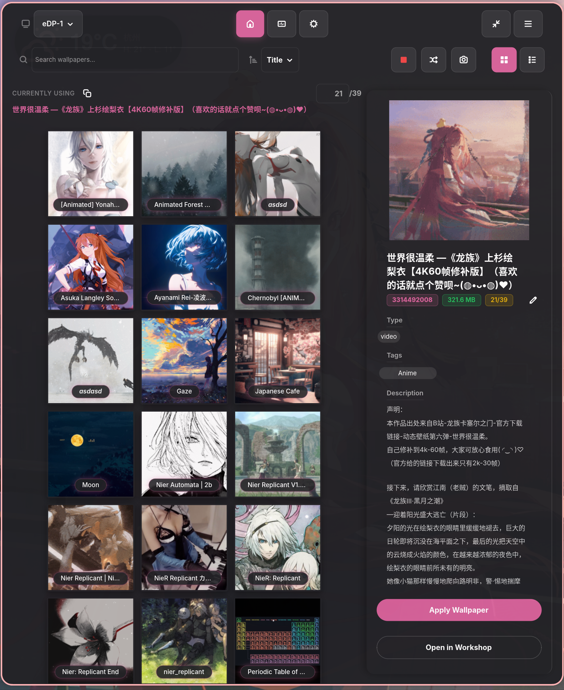
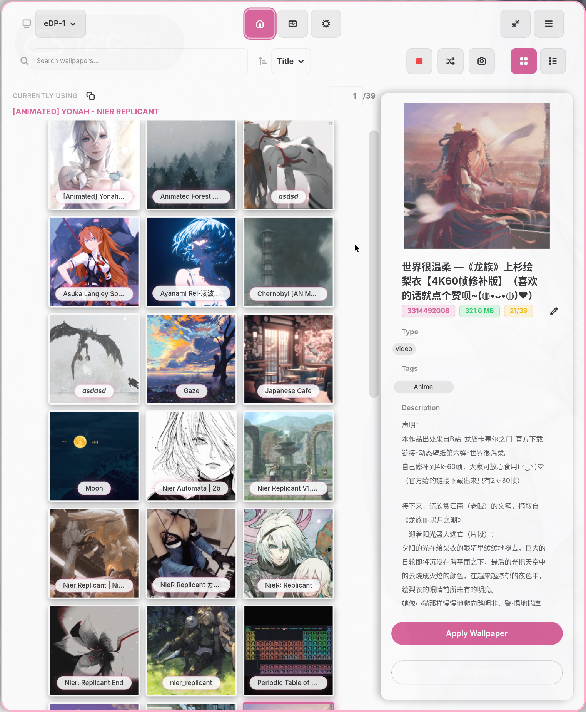
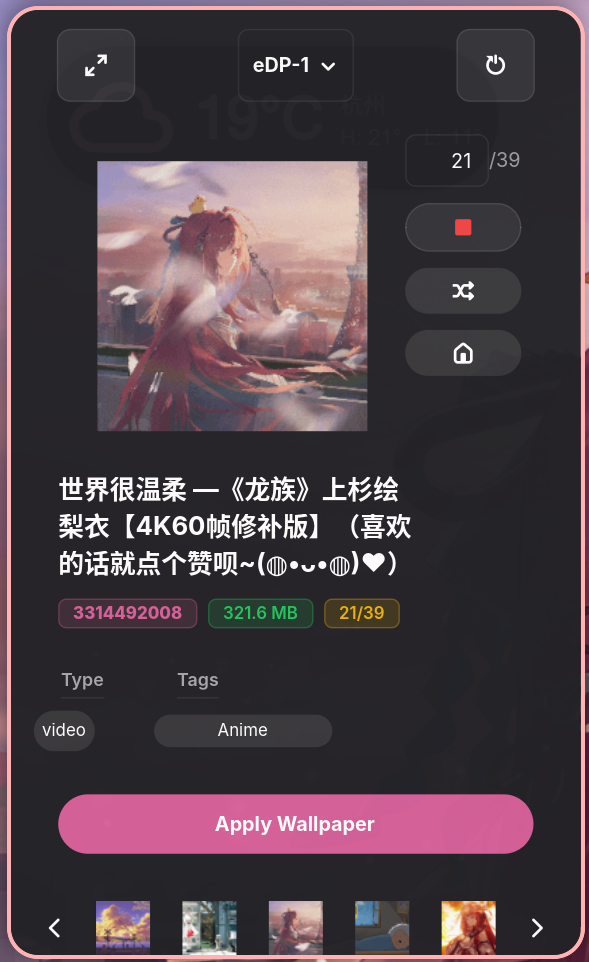
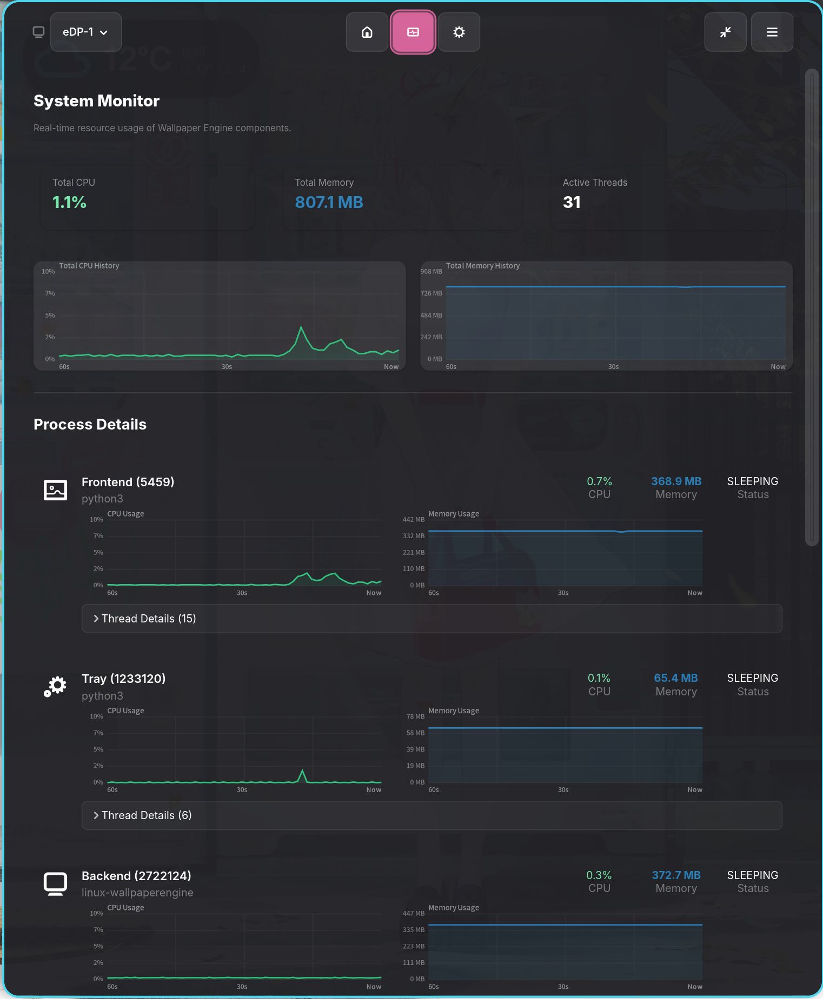
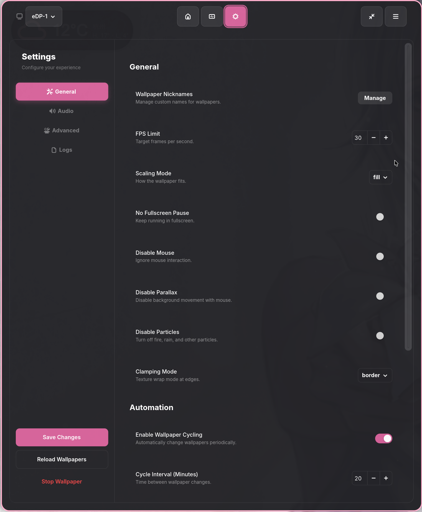
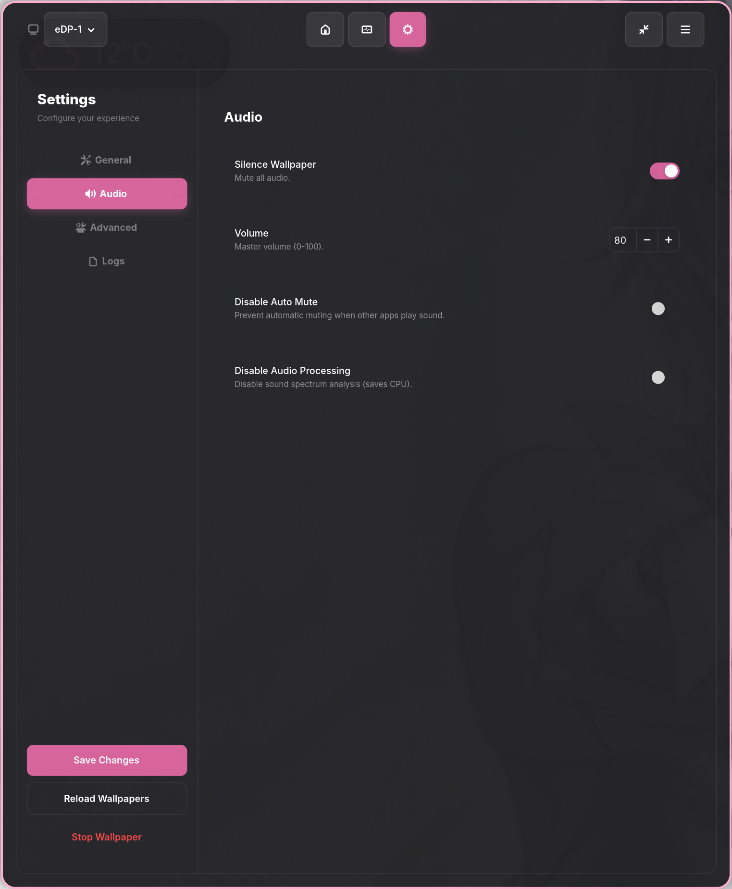
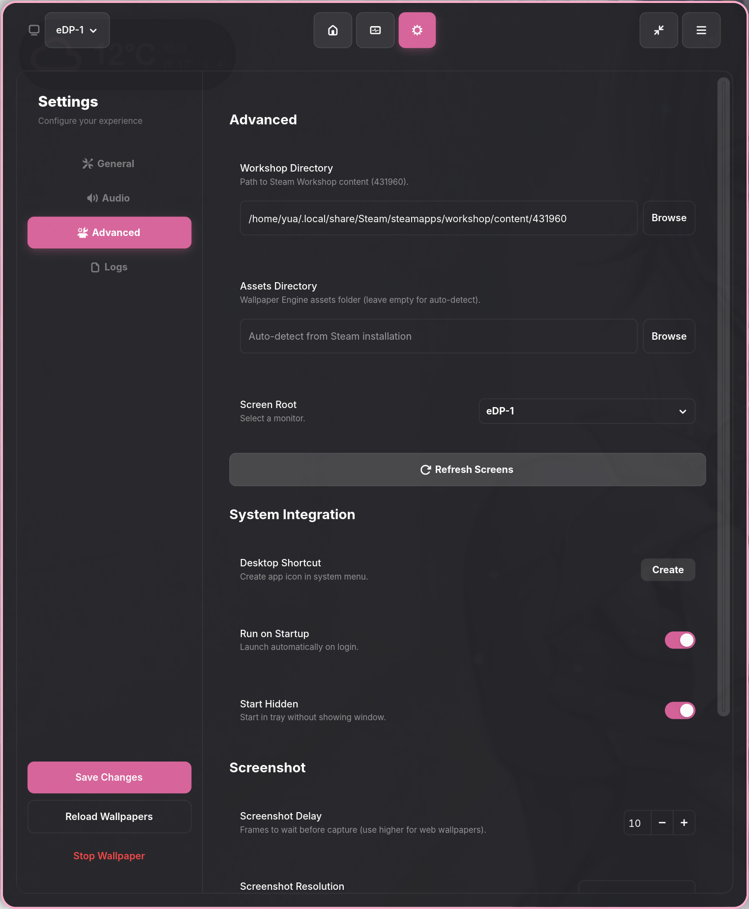

<h1 align="center">
  <br>
  LINUX WALLPAPER ENGINE GUI
</h1>

<p align="center">A modern GTK4 graphical interface for managing and applying Steam Workshop live wallpapers on Linux.</p>

<p align="center">
  <a href="https://github.com/Suhoiyis/gui-for-linux-wallpaperengine/releases/latest">
    
  </a>
  <a href="https://github.com/Suhoiyis/gui-for-linux-wallpaperengine/blob/main/LICENSE">
    
  </a>
  
  
  
</p>


<p align="center">
    <strong>English</strong> | 
    <a href="README_ZH.md">简体中文</a>
<p>

> [!NOTE]
> 🌐 Language Note: This English documentation was generated by AI and translating tools. While we strive for accuracy, some technical nuances might be lost. If you spot any linguistic errors, please feel free to  or submit a Pull Request. Your help is much appreciated!

> Built on [Almamu/linux-wallpaperengine](https://github.com/Almamu/linux-wallpaperengine) backend, optimized for GNOME / Wayland desktop environments.


<div align="center">
  <table width="100%">
    <tr>
      <td align="center"><b>Dark Mode</b></td>
      <td align="center"><b>Light Mode</b></td>
    </tr>
    <tr>
      <td align="center">
        
      </td>
      <td align="center">
        
      </td>
    </tr>
  </table>
</div>

## ✨ Features

### Core Features

- 🎨 **Light/Dark Theme Adaptive**: Fully adapts to your system's light or dark theme with automatic accent color sync — no more unreadable text in light mode
- 🖥️ **Multi-Monitor Support**: Set independent wallpapers for each display, with Link/Unlink mode for bulk or per-screen control
- 📜 **Playback History**: Automatically tracks your last 30 played wallpapers with timestamps, thumbnails, and one-click replay
- ✏️ **Nickname System**: Assign custom nicknames to wallpapers for easier identification; supports batch management and search integration
- 🔍 **Search & Sort**: Real-time keyword search across titles, descriptions, and tags; sort by name, size, type, or folder ID
- 📺 **System Tray**: Runs in background with quick actions — random switch, stop, show/hide window
- ⌨️ **Command-Line Control**: Full CLI support for headless operation and remote control via single-instance architecture

### Advanced Features

- 🪟 **Compact Preview Mode**: A dedicated mini-window (300×700) designed for tiling window managers (Niri, Hyprland, Sway) with circular thumbnail navigation and keyboard shortcuts

<p align="center">
  
  <br>
</p>


- 📊 **Performance Monitor**: Real-time CPU/memory tracking with 60-second sparkline charts, per-process breakdown (Frontend, Backend, Tray), and detailed thread lists

    <details>
      <summary>Click to view performance monitoring screenshots</summary>
      <div align="center">
        <br>
        
        <p><em>Real-time CPU/memory tracing and process details</em></p>
      </div>
    </details>

- 📸 **Smart Screenshot**: Silent 4K capture via Xvfb virtual framebuffer, intelligent delay per wallpaper type, resource usage stats, and screenshot history (last 10 captures)
- 🔄 **Timed Rotation**: Auto-switch wallpapers at configurable intervals; supports random mode and ordered cycling by title, size, type, or folder ID
- ☰ **Hamburger Menu**: Global application menu with Playback History, Check for Updates, Welcome Guide, Restart, and Quit
- 🎛️ **Wayland Advanced Tweaks**: Fine-grained control — pause only when active window is fullscreen, ignore specific app IDs (e.g., docks, bars)
- 📋 **Log Management**: Filter logs by module (Controller/Engine/GUI), copy filtered output for bug reports
- 🖼️ **GIF Smart Thumbnails**: Intelligent frame extraction (15th frame) to avoid blank/black preview images; supports transparent GIF rendering
- 🔔 **Update Checker**: Automatic GitHub release checking with smart rate-limit handling and semantic version comparison

## 🚀 Installation

### 1. Install the Backend (Required)
This GUI acts as a controller and requires the core rendering engine to be installed on your system.
Follow the build instructions for [Almamu/linux-wallpaperengine](https://github.com/Almamu/linux-wallpaperengine) and ensure the executable is in your system's PATH:

```bash
which linux-wallpaperengine  # Verify installation
```
(Arch Linux users can simply install it from the AUR: yay -S linux-wallpaperengine)

### 2. Install the GUI
Head over to the [Releases page](https://github.com/Suhoiyis/gui-for-linux-wallpaperengine/releases) to download the latest version, then choose your preferred method:

#### Method A: Arch Linux Package (Recommended for Arch/Manjaro)

We have not yet published the application to the AUR (it is currently planned), but we now provide a pre-built .pkg.tar.zst package. Installing it with pacman will automatically handle all GUI dependencies.

```Bash
# Replace with the actual downloaded filename
sudo pacman -U linux-wallpaperengine-gui-*-x86_64.pkg.tar.zst
```

Once installed, you can launch it from your application menu.


#### Method B: AppImage (Universal Linux)
A portable, zero-config executable. It integrates directly with your desktop environment and system tray.

```Bash
# Make it executable
chmod +x linux-wallpaperengine-gui-*-x86_64.AppImage

# Run it
./linux-wallpaperengine-gui-*-x86_64.AppImage
```

#### Method C: Run from Source
If you prefer running the Python script directly, please ensure you have the required dependencies:

```Bash
# Arch Linux
sudo pacman -S python-gobject gtk4 libadwaita libayatana-appindicator
# Ubuntu / Debian
sudo apt install python3-gi gir1.2-gtk-4.0 gir1.2-adw-1 libayatana-appindicator3-1
```

Then clone the repository and run:

```Bash
python3 run_gui.py
```

## 📖 Basic Usage

### Browse & Apply Wallpapers

1. **Browse**: The app automatically scans your Steam Workshop wallpaper library on first launch
2. **Apply**: Double-click a wallpaper card or click the **Apply** button in the sidebar
3. **Random**: Click the 🎲 button in the toolbar or use the tray menu
4. **Stop**: Click the ⏹ button in the toolbar
5. **Multi-Monitor**: Select the target display from the top bar dropdown, then apply

### Playback History

Access your recent wallpaper history via the **Hamburger Menu (☰) → Playback History**:

- View the last 30 wallpapers with thumbnails, nicknames (italic), original IDs, and timestamps (MM-DD HH:MM)
- One-click replay any previous wallpaper — the main window syncs automatically
- Clear history or check capacity (current / 30)

### Nickname Management

Give your wallpapers meaningful names:

- **Set a nickname**: Right-click a wallpaper → "Set Nickname", or click the ✏️ button in the sidebar
- **Batch manage**: Settings → "Manage Nicknames" to view, edit, or delete all nicknames in a dialog
- **Search integration**: The search box matches both nicknames and original titles
- **Visual distinction**: Nicknames appear in *italic bold* in the grid view; the sidebar shows "Nickname + Original Name (small gray text)"

### Compact Preview Mode

A lightweight preview window designed for tiling WMs:

- **Toggle**: Click the compact mode icon in the toolbar
- **Navigate**: Use `←` `→` keys or the on-screen buttons to cycle through 5 circular thumbnails
- **Quick actions**: Apply, Stop, Lucky (random), and Jump to current wallpaper
- **Window rules**: You may need to configure your WM to float this window — see [Advanced Guide](docs/ADVANCED.md#compact-preview-mode)

### Performance Monitoring

Click the monitor icon in the top bar to open the Performance page:

- **Overview cards**: Total CPU, Total Memory, Active Threads
- **Sparkline charts**: 60-second history for CPU (color-coded: green < 20%, orange < 40%, red ≥ 40%) and Memory (blue)
- **Process details**: Expand Frontend/Backend/Tray for individual metrics, thread names, and currently playing wallpapers

  <details>
  <summary>Click to expand the settings page screenshot</summary>
  <br>
  <div align="center">
    
    
    
    <p><em>General Settings / Audio / Advanced Tweaks</em></p>
  </div>
  </details>

## ⌨️ Command-Line Control

All commands are sent to the same running instance (single-instance architecture):

| Command | Action |
|---------|--------|
| `--show` | Show the window |
| `--hide` | Hide the window (process keeps running) |
| `--toggle` | Toggle show/hide |
| `--random` | Random wallpaper switch |
| `--stop` | Stop current wallpaper |
| `--apply-last` | Apply the last used wallpaper |
| `--refresh` | Rescan wallpaper library |
| `--quit` | Fully exit (GUI + all wallpaper processes) |

**Example:** Autostart with Niri
```bash
# In your niri config.kdl
spawn-at-startup "python3" "/path/to/run_gui.py" "--hidden"

binds {
    Mod+W { spawn "python3" "/path/to/run_gui.py" "--toggle"; }
    Mod+Shift+W { spawn "python3" "/path/to/run_gui.py" "--random"; }
}
```

## ⚙️ Configuration

**Location:** `~/.config/linux-wallpaperengine-gui/config.json`

Key settings (all configurable via the GUI's Settings page):

| Setting | Default | Description |
|---------|---------|-------------|
| `fps` | 30 | Frame rate limit (1–144) |
| `volume` | 50 | Audio volume (0–100) |
| `scaling` | `"default"` | Scaling mode: default / stretch / fit / fill |
| `silence` | `true` | Mute audio |
| `autoRotateEnabled` | `false` | Enable timed wallpaper rotation |
| `rotateInterval` | 30 | Rotation interval in minutes |
| `cycleOrder` | `"random"` | Cycle order: random / title / size / type / id |
| `useXvfb` | `true` | Use Xvfb for silent screenshots |
| `screenshotRes` | `"3840x2160"` | Screenshot resolution |

For the complete configuration reference, see [docs/ADVANCED.md](docs/ADVANCED.md#configuration-reference).

## ⚠️ Known Limitations

### Wallpaper Type Compatibility

| Type | Status | Notes |
|------|--------|-------|
| **Video** | ✅ Fully supported | MP4/WebM recommended |
| **Web** | ⚠️ Partial | Renders correctly, but **property adjustments are non-functional** (backend limitation) |
| **Scene** | ⚠️ Limited | Complex particle systems / custom shaders may glitch or fail |

### Wayland Limitations

- ❌ **Mouse interaction disabled**: Cannot obtain global cursor position; click interactions and mouse trails do not work
- ❌ **Web property injection limited**: CEF communication is restricted under Wayland's security model

For detailed compatibility information, see [docs/COMPATIBILITY.md](docs/COMPATIBILITY.md).

### Other Notes

- **Memory growth**: Long-running Web wallpapers may slowly increase memory usage (upstream engine issue). Enable timed rotation to mitigate.
- **Test environment**: Primarily tested on Arch Linux + Niri. Other environments may require adjustments.

## ❓ FAQ

### Why do Web wallpaper property adjustments not work?

The C++ backend uses CEF (Chromium Embedded Framework) for Web wallpapers. On Linux/Wayland, CEF's inter-process communication has compatibility issues that prevent JavaScript property injection from working reliably. Wallpapers will run with their default settings. As a workaround, you can manually edit the wallpaper's `project.json` or HTML source files.

### How can I reduce memory usage?

1. Avoid Web wallpapers (they use CEF/Chromium internally)
2. Enable timed rotation (Settings → Automation) to periodically restart the backend
3. Lower FPS (Settings → General)
4. Disable audio processing (Settings → Advanced)

### The compact preview window doesn't float in my tiling WM

You need to add a window rule in your WM configuration. See [docs/ADVANCED.md](docs/ADVANCED.md#compact-preview-mode) for Niri and Hyprland examples.

### Why are screenshots slow (5–10 seconds)?

If Xvfb is installed, the app uses CPU software rendering to produce 4K screenshots silently (no popup window). This is slower but guarantees consistent quality regardless of your physical screen resolution or tiling WM layout. You can disable Xvfb mode in Settings → Advanced for faster (but windowed) screenshots.

### System tray icon is not showing

1. Verify `libayatana-appindicator` is installed
2. GNOME users: Install the "AppIndicator Support" extension
3. Waybar users: Ensure the `tray` module is configured
4. i3/Sway users: You may need `waybar` or another status bar with tray support

### How do I set different wallpapers for each monitor?

Select the target display from the top bar dropdown, then browse and apply a wallpaper. Repeat for each monitor. Use the 🔗 Link/Unlink button to toggle between applying to all screens (Same mode) or just the selected screen (Diff mode).

### Can I use this with Flatpak or AppImage?

**AppImage**: Fully supported since v0.10.4 with zero-config desktop integration. The app auto-creates `.desktop` shortcuts and self-heals if the file is moved.

**Flatpak**: Not officially supported yet. File access and sandbox restrictions may affect functionality.

### How do I report a bug?

1. Go to Settings → Logs and click **Copy Logs**
2. Open a [GitHub Issue](https://github.com/Suhoiyis/gui-for-linux-wallpaperengine/issues)
3. Include: system info (`uname -a`), desktop environment, wallpaper ID/type, and the copied logs

## 🏛️ Technical Architecture

### Project Structure

```
suw/
├── py_GUI/                    # Main application package
│   ├── core/                  # Core logic
│   │   ├── controller.py      # WallpaperController — process management
│   │   ├── config_manager.py  # ConfigManager — settings I/O with robust fallback
│   │   ├── history.py         # HistoryManager — playback history (30 entries)
│   │   └── nickname.py        # NicknameManager — alias persistence
│   ├── ui/                    # User interface
│   │   ├── app.py             # Main application window
│   │   ├── components/        # Reusable components (navbar, sidebar, preview)
│   │   └── pages/             # Page views (wallpapers, settings, performance)
│   ├── utils/                 # Utilities
│   │   ├── performance.py     # PerformanceMonitor — CPU/memory tracking
│   │   └── logger.py          # Logging configuration
│   └── const.py               # Constants, version, CSS styles
├── run_gui.py                 # Entry point
├── docs/                      # Documentation
│   └── assets/                # Screenshots and images
└── pic/icons/                 # Application icons
```

### Architecture Overview

```
┌──────────────────────────────────────────────────┐
│                    GTK4 + Libadwaita             │
│  ┌──────────┐  ┌──────────┐  ┌────────────────┐  │
│  │ Wallpaper│  │ Settings │  │  Performance   │  │
│  │   Page   │  │   Page   │  │    Monitor     │  │
│  └────┬─────┘  └────┬─────┘  └───────┬────────┘  │
│       │             │                │           │
│  ┌────┴─────────────┴────────────────┴─────────┐ │
│  │           WallpaperController               │ │
│  │  ┌──────────┐ ┌──────────┐ ┌──────────────┐ │ │
│  │  │ Config   │ │ History  │ │  Nickname    │ │ │
│  │  │ Manager  │ │ Manager  │ │  Manager     │ │ │
│  │  └──────────┘ └──────────┘ └──────────────┘ │ │
│  └──────────────────┬──────────────────────────┘ │
│                     │ subprocess                 │
│  ┌──────────────────┴───────────────────────────┐│
│  │         linux-wallpaperengine (C++)          ││
│  │         Rendering · Audio · Screenshot       ││
│  └──────────────────────────────────────────────┘│
│                                                  │
│  ┌─────────────────────────────────────────────┐ │
│  │         System Tray (libayatana)            │ │
│  └─────────────────────────────────────────────┘ │
└──────────────────────────────────────────────────┘
```

### Key Design Decisions

- **Single-instance architecture**: All CLI commands route to the running GTK application via `Gio.Application`, avoiding process duplication
- **Defensive configuration**: `ConfigManager.get()` handles `None` values and falsy-but-valid values (e.g., `volume=0`) correctly
- **Theme variables**: All UI colors use GTK/Libadwaita named colors (`@window_bg_color`, `@theme_fg_color`, `@accent_bg_color`) for seamless theme adaptation
- **Object pooling**: Compact mode thumbnails use object pooling to eliminate scroll jank

## 📚 Documentation

| Document | Description |
|----------|-------------|
| [CHANGELOG.md](docs/CHANGELOG.md) | Version history and release notes |
| [docs/ADVANCED.md](docs/ADVANCED.md) | Advanced features, configuration reference, and WM integration |
| [docs/COMPATIBILITY.md](docs/COMPATIBILITY.md) | Wallpaper type compatibility, Wayland limitations, hardware requirements |
| [docs/TROUBLESHOOTING.md](docs/TROUBLESHOOTING.md) | Common errors, backend log analysis, and fixes |

## 🔧 Tech Stack

- **Language**: Python 3.10+
- **UI Framework**: PyGObject (GTK4 + Libadwaita)
- **System Tray**: libayatana-appindicator
- **Backend**: Almamu/linux-wallpaperengine (C++)
- **Charts**: Cairo-based sparkline components

## 🤝 Contributing

Contributions are welcome!

- Feature requests and bug reports → [Open an Issue](https://github.com/Suhoiyis/gui-for-linux-wallpaperengine/issues)
- Code contributions → Follow existing code style and submit a Pull Request
- Documentation improvements are equally appreciated

## 🙏 Acknowledgements

> Some UI design inspiration was drawn from [AzPepoze/linux-wallpaperengine-gui](https://github.com/AzPepoze/linux-wallpaperengine-gui).
>
> It is an excellent GUI project — we recommend checking it out.

## 📄 License

GPL-3.0 license

---

**Current Version**: v0.11.2

**Last Updated**: 2026-02-22

*A Vibe Coding experiment project*
