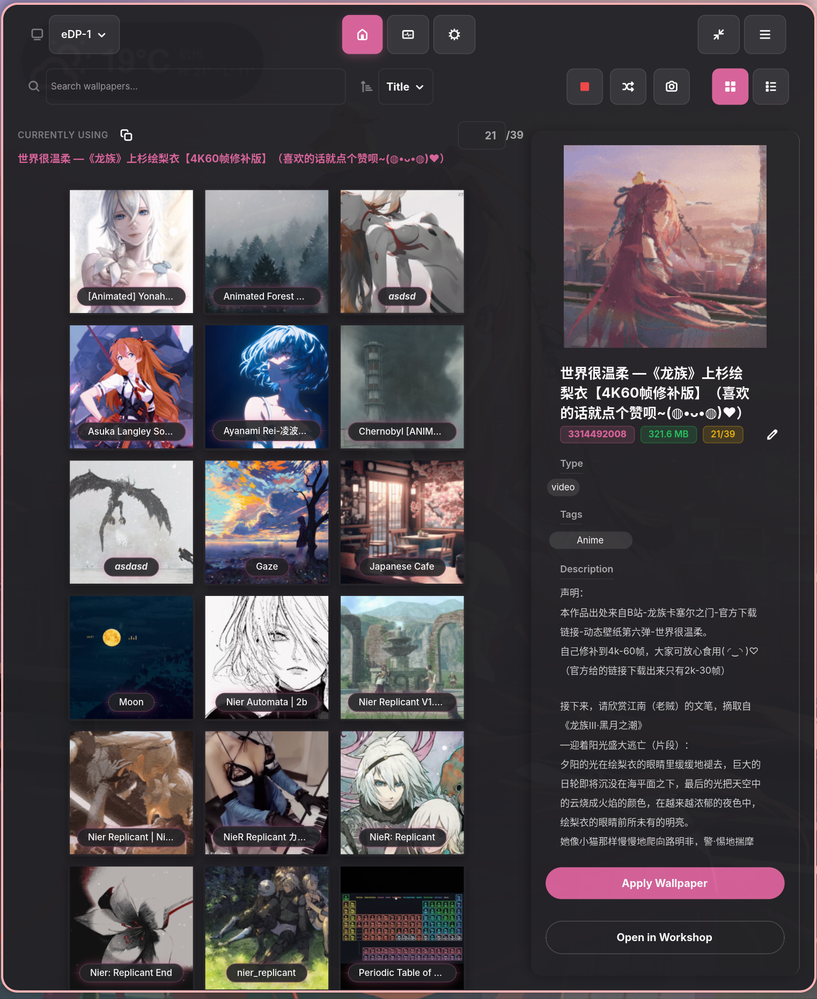
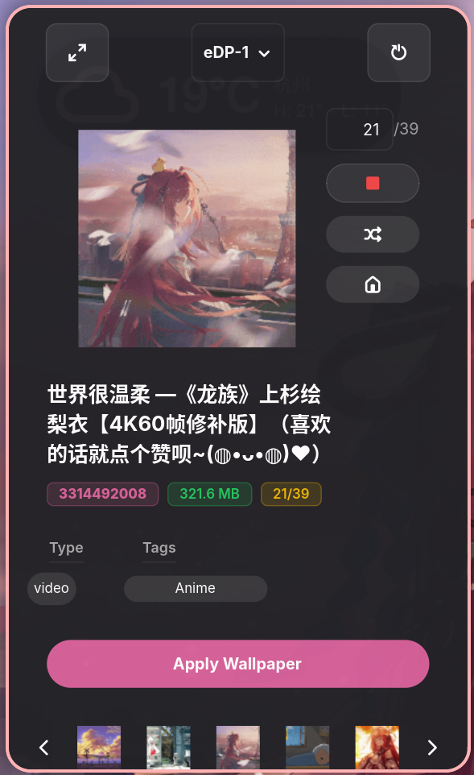
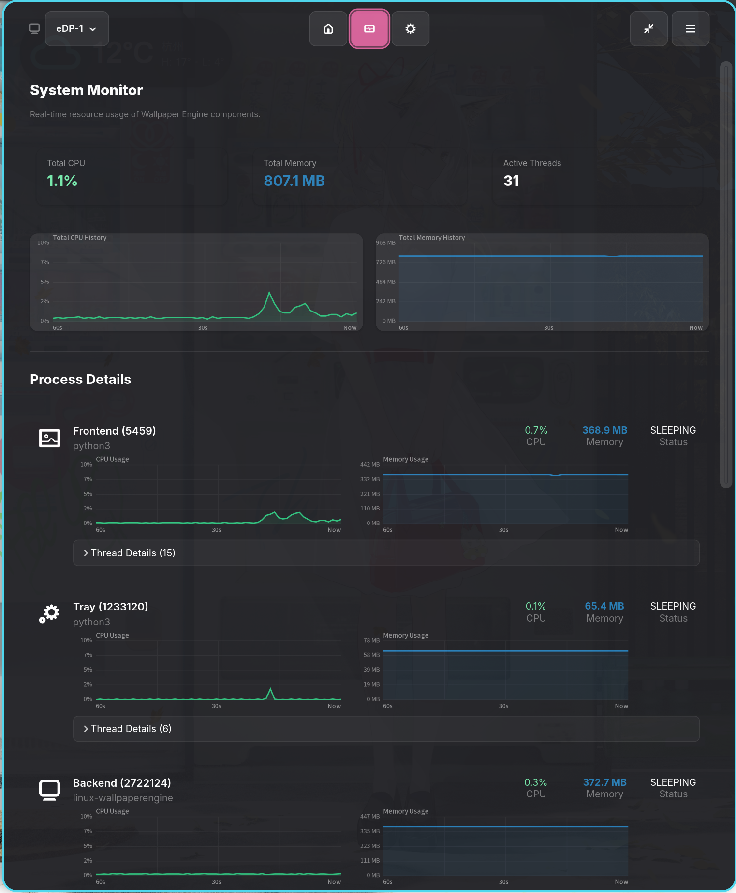
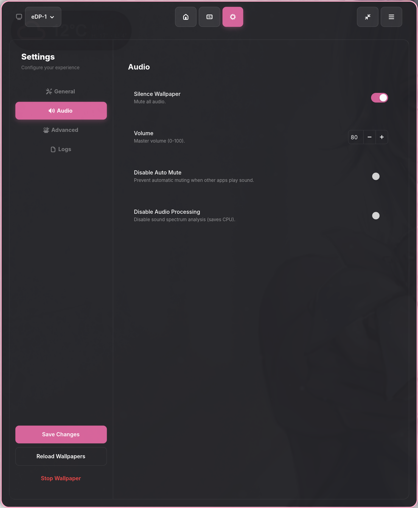
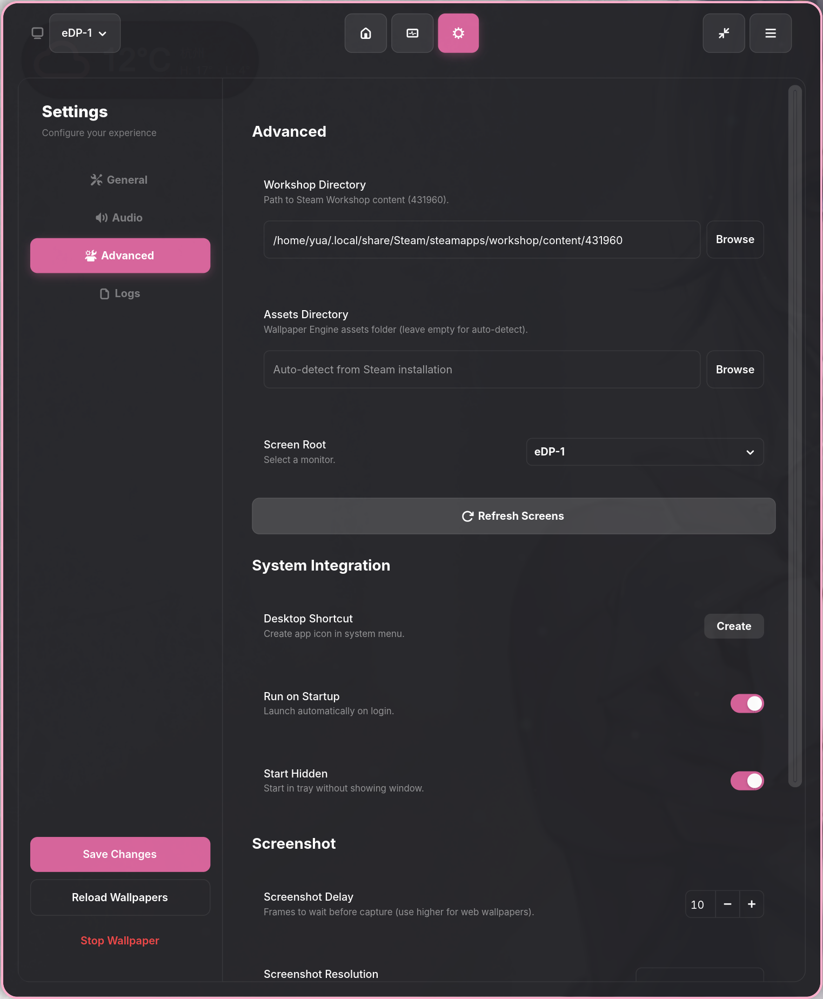

<h1 align="center">
  <br>
  LINUX WALLPAPER ENGINE GUI
</h1>

<p align="center">一个现代化的 GTK4 图形界面，用于在 Linux 上管理和应用 Steam Workshop 动态壁纸。</p>

<p align="center">
  <a href="https://github.com/Suhoiyis/gui-for-linux-wallpaperengine/releases/latest">
    
  </a>
  <a href="https://github.com/Suhoiyis/gui-for-linux-wallpaperengine/blob/main/LICENSE">
    
  </a>
  
  
  
</p>

<p align="center">
    <a href="README.md">English</a> | 
    <strong>简体中文</strong>
<p>

> 基于 [linux-wallpaperengine](https://github.com/Almamu/linux-wallpaperengine) 后端构建，针对 GNOME / Wayland 桌面环境进行了优化。

<div align="center">
  <table width="100%">
    <tr>
      <td align="center"><b>深色模式</b></td>
      <td align="center"><b>浅色模式</b></td>
    </tr>
    <tr>
      <td align="center">
        
      </td>
      <td align="center">
        
      </td>
    </tr>
  </table>
</div>

## ✨ 功能特性

### 核心功能

- 🎨 **浅色/深色主题自适应**: 完全适配系统的浅色或深色主题，并自动同步强调色 —— 告别浅色模式下难以阅读的文本
- 🖥️ **多显示器支持**: 为每个显示器设置独立的壁纸，支持“链接/取消链接”模式进行批量或逐屏控制
- 📜 **播放历史**: 自动追踪最近播放的 30 张壁纸，包含时间戳、缩略图和一键重播功能
- ✏️ **别名系统**: 为壁纸分配自定义别名以便于识别；支持批量管理和搜索集成
- 🔍 **搜索与排序**: 对标题、描述和标签进行实时关键词搜索；支持按名称、大小、类型或文件夹 ID 排序
- 📺 **系统托盘**: 在后台运行并提供快捷操作 —— 随机切换、停止、显示/隐藏窗口
- ⌨️ **命令行控制**: 完整的 CLI 支持，通过单实例架构实现无头操作和远程控制

### 进阶功能

- 🪟 **紧凑预览模式**: 专为平铺式窗口管理器（Niri, Hyprland, Sway）设计的独立迷你窗口（300×700），支持圆形缩略图导航和键盘快捷键

<p align="center">
  
  <br>
</p>

- 📊 **性能监控**: 实时 CPU/内存追踪，提供 60 秒实时趋势图、分进程明细（前端、后端、托盘）以及详细的线程列表

  <details>
    <summary>点击查看性能监控截图</summary>
    <div align="center">
      <br>
      
      <p><em>实时CPU/内存跟踪和进程详细信息</em></p>
    </div>
  </details>

- 📸 **智能截图**: 通过 Xvfb 虚拟帧缓冲进行静默 4K 截屏，根据壁纸类型智能延迟，提供资源占用统计和截图历史（最近 10 张）
- 🔄 **定时轮换**: 按可配置的时间间隔自动切换壁纸；支持随机模式和按标题、大小、类型或文件夹 ID 的顺序轮换
- ☰ **汉堡菜单**: 全局应用菜单，包含播放历史、检查更新、欢迎指南、重启和退出
- 🎛️ **Wayland 高级微调**: 精细化控制 —— 仅在活动窗口全屏时暂停，忽略特定的 app ID（如 dock、状态栏）
- 📋 **日志管理**: 按模块（控制器/引擎/GUI）过滤日志，支持复制过滤后的输出以便提交错误报告
- 🖼️ **GIF 智能缩略图**: 智能帧提取（第 15 帧）以避免空白/黑色预览图；支持透明 GIF 渲染
- 🔔 **更新检查器**: 自动检查 GitHub Release，具备智能速率限制处理和语义化版本比较功能

## 🚀 安装指南

### 1. 安装后端（必须）
本 GUI 作为控制端，需要您的系统上先安装核心渲染引擎。
请参考 [Almamu/linux-wallpaperengine](https://github.com/Almamu/linux-wallpaperengine) 的编译说明进行安装，并确保该程序已加入系统的环境变量 PATH 中：

```bash
which linux-wallpaperengine  # 验证安装是否成功
```
（Arch Linux 用户可以直接从 AUR 安装：yay -S linux-wallpaperengine）

### 2. 安装 GUI 控制端
前往 [Releases 页面](https://github.com/Suhoiyis/gui-for-linux-wallpaperengine/releases) 下载最新版本，然后选择您喜欢的安装方式：

#### 方法 A：Arch Linux 安装包（Arch/Manjaro 用户推荐）

我们暂未将应用上架AUR仓库（正在计划中），但是我们现在提供了预编译的 .pkg.tar.zst 包。使用 pacman 安装会自动处理所有的 GUI 依赖项。

```Bash
# 请将文件名替换为您实际下载的文件
sudo pacman -U linux-wallpaperengine-gui-*-x86_64.pkg.tar.zst
```

安装完成后，您就可以直接在桌面应用启动器中找到它了。

#### 方法 B：AppImage
开箱即用的便携格式，无需配置依赖，完美集成桌面快捷方式和系统托盘。

```Bash
# 赋予执行权限
chmod +x linux-wallpaperengine-gui-*-x86_64.AppImage

# 运行
./linux-wallpaperengine-gui-*-x86_64.AppImage
```

#### 方法 C：源码运行
如果您更喜欢直接运行 Python 脚本，请先安装前置依赖库：

```Bash
# Arch Linux
sudo pacman -S python-gobject gtk4 libadwaita libayatana-appindicator
# Ubuntu / Debian
sudo apt install python3-gi gir1.2-gtk-4.0 gir1.2-adw-1 libayatana-appindicator3-1
```

然后克隆本仓库并运行：

```Bash
python3 run_gui.py
```

## 📖 基本用法

### 浏览与应用壁纸

1. **浏览**: 应用在首次启动时会自动扫描您的 Steam Workshop 壁纸库
2. **应用**: 双击壁纸卡片或点击侧边栏中的 **Apply** 按钮
3. **随机**: 点击工具栏中的 🎲 按钮或使用托盘菜单
4. **停止**: 点击工具栏中的 ⏹ 按钮
5. **多显示器**: 从顶栏下拉菜单中选择目标显示器，然后应用

### 播放历史

通过 **汉堡菜单 (☰) → 播放历史** 访问您最近的壁纸历史：

- 查看最近 30 张壁纸，包含缩略图、别名（斜体）、原始 ID 和时间戳（MM-DD HH:MM）
- 一键重播之前的任何壁纸 —— 主窗口会自动同步
- 清除历史记录或检查容量（当前 / 30）

### 别名管理

为您的壁纸赋予有意义的名称：

- **设置别名**: 右键点击壁纸 → "Set Nickname"，或点击侧边栏中的 ✏️ 按钮
- **批量管理**: 设置 → "Manage Nicknames"，在对话框中查看、编辑或删除所有别名
- **搜索集成**: 搜索框同时匹配别名和原始标题
- **视觉区分**: 别名在网格视图中以 *加粗斜体* 显示；侧边栏显示“别名 + 原始名称（灰色小字）”

### 紧凑预览模式

专为平铺式窗口管理器设计的轻量级预览窗口：

- **切换**: 点击工具栏中的紧凑模式图标
- **导航**: 使用 `←` `→` 键或屏幕按钮循环切换 5 个圆形缩略图
- **快速操作**: 应用、停止、碰运气（随机）以及跳转到当前壁纸
- **窗口规则**: 您可能需要配置窗口管理器使该窗口浮动 —— 参见 [进阶指南](docs/ADVANCED.md#compact-preview-mode)

### 性能监控

点击顶栏的监控图标打开性能页面：

- **概览卡片**: 总 CPU、总内存、活动线程
- **趋势图**: 60 秒 CPU 历史（颜色标识：绿色 < 20%，橙色 < 40%，红色 ≥ 40%）和内存历史（蓝色）
- **进程详情**: 展开前端/后端/托盘以查看各项指标、线程名称和当前播放的壁纸

<details>
<summary>点击展开设置页面截图</summary>
<br>
<div align="center">
  
  
  
  <p><em>General Settings / Audio / Advanced Tweaks</em></p>
</div>
</details>

## ⌨️ 命令行控制

所有命令都发送到同一个运行中的实例（单实例架构）：

| 命令 | 动作 |
|---------|--------|
| `--show` | 显示窗口 |
| `--hide` | 隐藏窗口（进程继续运行） |
| `--toggle` | 切换显示/隐藏 |
| `--random` | 随机切换壁纸 |
| `--stop` | 停止当前壁纸 |
| `--apply-last` | 应用上次使用的壁纸 |
| `--refresh` | 重新扫描壁纸库 |
| `--quit` | 完全退出（GUI + 所有壁纸进程） |

**示例:** 在 Niri 中自动启动
```bash
# In your niri config.kdl
spawn-at-startup "python3" "/path/to/run_gui.py" "--hidden"

binds {
    Mod+W { spawn "python3" "/path/to/run_gui.py" "--toggle"; }
    Mod+Shift+W { spawn "python3" "/path/to/run_gui.py" "--random"; }
}
```

## ⚙️ 配置

**位置:** `~/.config/linux-wallpaperengine-gui/config.json`

关键设置（均可通过 GUI 的设置页面进行配置）：

| 设置 | 默认值 | 描述 |
|---------|---------|-------------|
| `fps` | 30 | 帧率限制 (1–144) |
| `volume` | 50 | 音量 (0–100) |
| `scaling` | `"default"` | 缩放模式: default / stretch / fit / fill |
| `silence` | `true` | 静音 |
| `autoRotateEnabled` | `false` | 启用定时轮换 |
| `rotateInterval` | 30 | 轮换间隔（分钟） |
| `cycleOrder` | `"random"` | 轮换顺序: random / title / size / type / id |
| `useXvfb` | `true` | 使用 Xvfb 进行静默截图 |
| `screenshotRes` | `"3840x2160"` | 截图分辨率 |

有关完整的配置参考，请参阅 [docs/ADVANCED.md](docs/ADVANCED.md#configuration-reference)。

## ⚠️ 已知限制

### 壁纸类型兼容性

| 类型 | 状态 | 备注 |
|------|--------|-------|
| **Video** | ✅ 完全支持 | 推荐使用 MP4/WebM |
| **Web** | ⚠️ 部分支持 | 渲染正常，但 **属性调节功能失效**（后端限制） |
| **Scene** | ⚠️ 受限 | 复杂的粒子系统 / 自定义着色器可能会出现闪烁或失败 |

### Wayland 限制

- ❌ **禁用鼠标交互**: 无法获取全局光标位置；点击交互和鼠标拖尾效果无法工作
- ❌ **Web 属性注入受限**: 在 Wayland 的安全模型下，CEF 通信受到限制

有关详细的兼容性信息，请参阅 [docs/COMPATIBILITY.md](docs/COMPATIBILITY.md)。

### 其他说明

- **内存增长**: 长期运行的 Web 壁纸可能会缓慢增加内存占用（上游引擎问题）。启用定时轮换可以缓解此问题。
- **测试环境**: 主要在 Arch Linux + Niri 上进行测试。其他环境可能需要调整。

## ❓ 常见问题

### 为什么 Web 壁纸的属性调节不起作用？

C++ 后端使用 CEF (Chromium Embedded Framework) 处理 Web 壁纸。在 Linux/Wayland 上，CEF 的进程间通信存在兼容性问题，导致 JavaScript 属性注入无法可靠工作。壁纸将以默认设置运行。作为权宜之计，您可以手动编辑壁纸的 `project.json` 或 HTML 源文件。

### 如何降低内存占用？

1. 避免使用 Web 壁纸（它们内部使用 CEF/Chromium）
2. 启用定时轮换（设置 → 自动化）以定期重启后端
3. 降低 FPS（设置 → 常规）
4. 禁用音频处理（设置 → 高级）

### 紧凑预览窗口在我的平铺式窗口管理器中没有浮动

您需要在窗口管理器配置中添加窗口规则。请参阅 [docs/ADVANCED.md](docs/ADVANCED.md#compact-preview-mode) 查看 Niri 和 Hyprland 的示例。

### 为什么截图很慢（5–10 秒）？

如果安装了 Xvfb，应用会使用 CPU 软件渲染来静默生成 4K 截图（无弹出窗口）。这虽然较慢，但无论您的物理屏幕分辨率或平铺式窗口管理器布局如何，都能保证一致的质量。您可以在“设置 → 高级”中禁用 Xvfb 模式以获得更快的（但会弹出窗口的）截图。

### 系统托盘图标不显示

1. 确认已安装 `libayatana-appindicator`
2. GNOME 用户：安装 "AppIndicator Support" 扩展
3. Waybar 用户：确保已配置 `tray` 模块
4. i3/Sway 用户：您可能需要 `waybar` 或其他支持托盘的状态栏

### 如何为每个显示器设置不同的壁纸？

从顶栏下拉菜单中选择目标显示器，然后浏览并应用壁纸。对每个显示器重复此操作。使用 🔗 链接/取消链接按钮在“应用于所有屏幕（相同模式）”或“仅应用于所选屏幕（差异模式）”之间切换。

### 我可以使用 Flatpak 或 AppImage 吗？

**AppImage**: 自 v0.10.4 起完全支持，具备零配置桌面集成。应用会自动创建 `.desktop` 快捷方式，并在文件移动时自我修复。

**Flatpak**: 目前尚未正式支持。文件访问和沙盒限制可能会影响功能。

### 如何报告错误？

1. 前往 设置 → 日志，点击 **Copy Logs**
2. 提交一个 [GitHub Issue](https://github.com/Suhoiyis/gui-for-linux-wallpaperengine/issues)
3. 包含：系统信息 (`uname -a`)、桌面环境、壁纸 ID/类型以及复制的日志

## 🏛️ 技术架构

### 项目结构

```
suw/
├── py_GUI/                    # Main application package
│   ├── core/                  # Core logic
│   │   ├── controller.py      # WallpaperController — process management
│   │   ├── config_manager.py  # ConfigManager — settings I/O with robust fallback
│   │   ├── history.py         # HistoryManager — playback history (30 entries)
│   │   └── nickname.py        # NicknameManager — alias persistence
│   ├── ui/                    # User interface
│   │   ├── app.py             # Main application window
│   │   ├── components/        # Reusable components (navbar, sidebar, preview)
│   │   └── pages/             # Page views (wallpapers, settings, performance)
│   ├── utils/                 # Utilities
│   │   ├── performance.py     # PerformanceMonitor — CPU/memory tracking
│   │   └── logger.py          # Logging configuration
│   └── const.py               # Constants, version, CSS styles
├── run_gui.py                 # Entry point
├── docs/                      # Documentation
│   └── assets/                # Screenshots and images
└── pic/icons/                 # Application icons
```

### 架构概览

```
┌──────────────────────────────────────────────────┐
│                    GTK4 + Libadwaita             │
│  ┌──────────┐  ┌──────────┐  ┌────────────────┐  │
│  │ Wallpaper│  │ Settings │  │  Performance   │  │
│  │   Page   │  │   Page   │  │    Monitor     │  │
│  └────┬─────┘  └────┬─────┘  └───────┬────────┘  │
│       │             │                │           │
│  ┌────┴─────────────┴────────────────┴─────────┐ │
│  │           WallpaperController               │ │
│  │  ┌──────────┐ ┌──────────┐ ┌──────────────┐ │ │
│  │  │ Config   │ │ History  │ │  Nickname    │ │ │
│  │  │ Manager  │ │ Manager  │ │  Manager     │ │ │
│  │  └──────────┘ └──────────┘ └──────────────┘ │ │
│  └──────────────────┬──────────────────────────┘ │
│                     │ subprocess                 │
│  ┌──────────────────┴───────────────────────────┐│
│  │         linux-wallpaperengine (C++)          ││
│  │         Rendering · Audio · Screenshot       ││
│  └──────────────────────────────────────────────┘│
│                                                  │
│  ┌─────────────────────────────────────────────┐ │
│  │         System Tray (libayatana)            │ │
│  └─────────────────────────────────────────────┘ │
└──────────────────────────────────────────────────┘
```

### 关键设计决策

- **单实例架构**: 所有 CLI 命令都通过 `Gio.Application` 路由到运行中的 GTK 应用，避免进程重复
- **防御性配置**: `ConfigManager.get()` 正确处理 `None` 值和“假值但有效”的值（例如 `volume=0`）
- **主题变量**: 所有 UI 颜色均使用 GTK/Libadwaita 命名颜色（`@window_bg_color`, `@theme_fg_color`, `@accent_bg_color`），实现无缝主题适配
- **对象池**: 紧凑模式缩略图使用对象池技术以消除滚动卡顿

## 📚 文档

| 文档 | 描述 |
|----------|-------------|
| [CHANGELOG_CN.md](CHANGELOG_CN.md) | 版本历史和发布说明 |
| [docs/ADVANCED_CN.md](docs/ADVANCED_CN.md) | 进阶功能、配置参考及窗口管理器集成 |
| [docs/COMPATIBILITY_CN.md](docs/COMPATIBILITY_CN.md) | 壁纸类型兼容性、Wayland 限制及硬件要求 |
| [docs/TROUBLESHOOTING_CN.md](docs/TROUBLESHOOTING_CN.md) | 常见错误、后端日志分析及修复方案 |

## 🔧 技术栈

- **语言**: Python 3.10+
- **UI 框架**: PyGObject (GTK4 + Libadwaita)
- **系统托盘**: libayatana-appindicator
- **后端**: linux-wallpaperengine (C++)
- **图表**: 基于 Cairo 的实时趋势图组件

## 🤝 贡献

欢迎贡献！

- 功能请求和错误报告 → [提交 Issue](https://github.com/Suhoiyis/gui-for-linux-wallpaperengine/issues)
- 代码贡献 → 遵循现有代码风格并提交 Pull Request
- 同样欢迎对文档进行改进

## 🙏 致谢

> 部分 UI 设计灵感源自 [AzPepoze/linux-wallpaperengine-gui](https://github.com/AzPepoze/linux-wallpaperengine-gui)。
>
> 这是一个非常优秀的 GUI 项目 —— 我们推荐您也去关注一下。

## 📄 许可证

GPL-3.0 license

---

**Current Version**: v0.11.2

**Last Updated**: 2026-02-22

*A Vibe Coding experiment project*
